# Mission Control AI

### Global Solution 2026.1 - Cross-Platform Application Development | FIAP

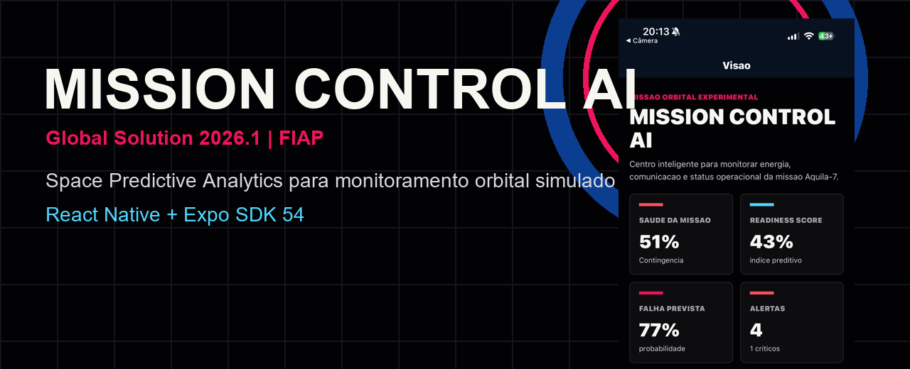

## Descricao

Mission Control AI e um aplicativo mobile em React Native + Expo criado para o desafio Space Predictive Analytics. O app simula uma missao orbital chamada Aquila-7 e monitora sensores, energia, comunicacao, estabilidade orbital e alertas criticos. A solucao organiza dados simulados em dashboards, gera respostas por limiares configuraveis e persiste as configuracoes do operador no dispositivo.

## Equipe

| Nome | RM |
|------|----|
| Rodrigo Campos Cordeiro | RM566386 |

## Telas do Aplicativo

### Home - Dashboard Principal
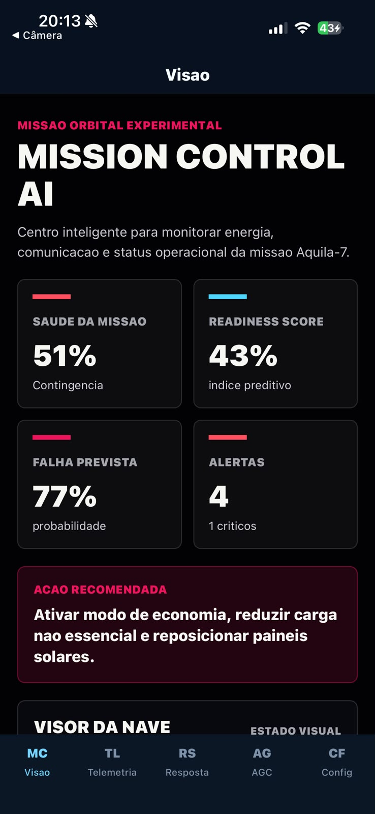
Visao geral dos indicadores da missao: saude operacional, readiness score, probabilidade de falha, alertas ativos e acao recomendada.

### Home - Mapa Orbital
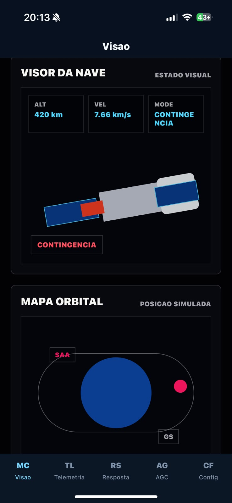
Representacao visual da nave, mapa orbital, estabilidade, deriva e vetor de estado dos subsistemas.

### Dashboard de Sensores
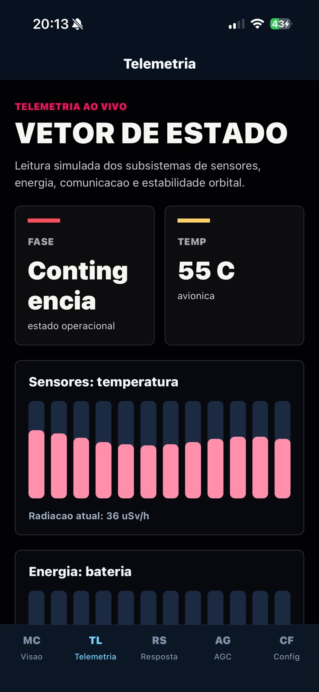
Dashboard com leituras simuladas de sensores, temperatura, fase operacional e historico de telemetria.

### Dashboard de Energia

Indicadores de bateria, entrada solar e evolucao da energia da missao em tempo real simulado.

### Dashboard de Comunicacao
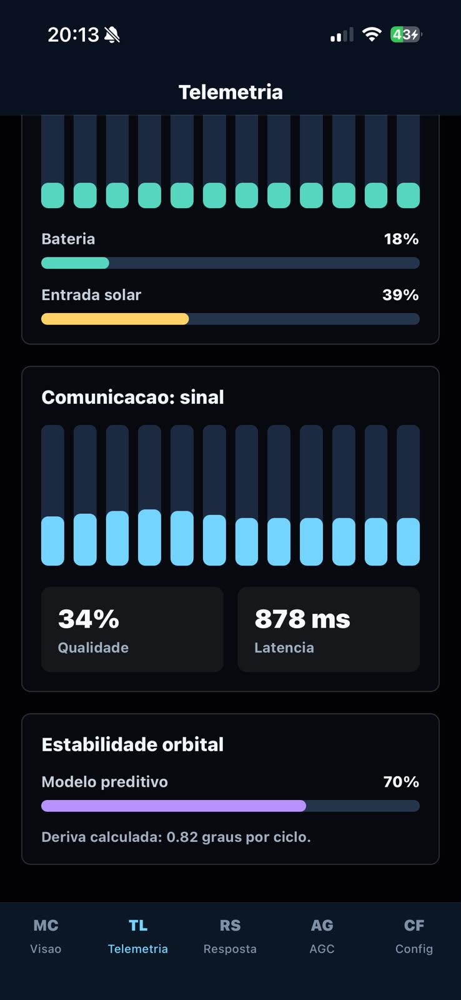
Status do link de telemetria, qualidade do sinal, latencia e estabilidade orbital.

### Alertas
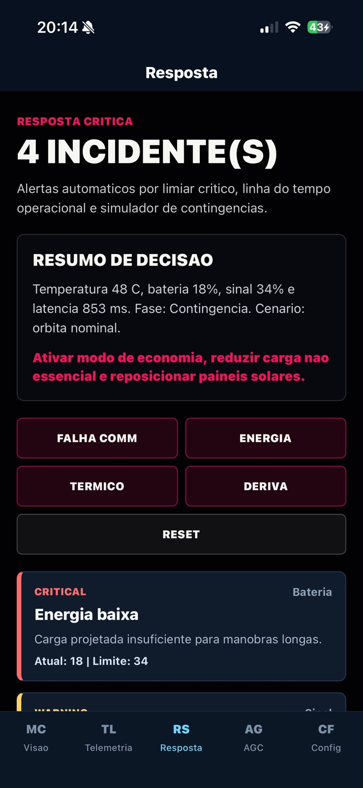
Lista de incidentes ativos gerados automaticamente com base nos limiares criticos da missao.

### Alertas - Linha do Tempo
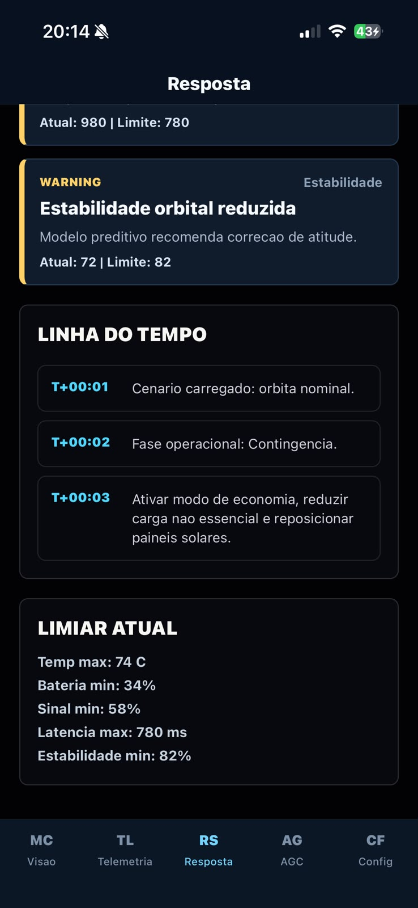
Timeline operacional com eventos detectados, recomendacoes e limites usados pelo sistema de resposta.

### Configuracoes / Formulario
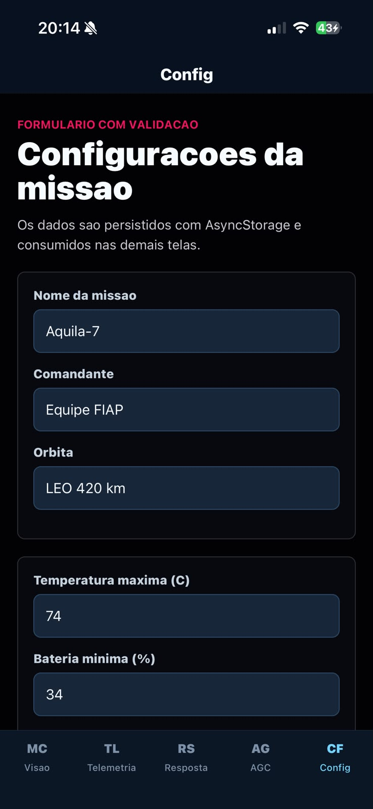
Formulario de configuracao da missao com inputs controlados para nome, comandante, orbita e limiares.

### Configuracoes - Limiar de Alertas
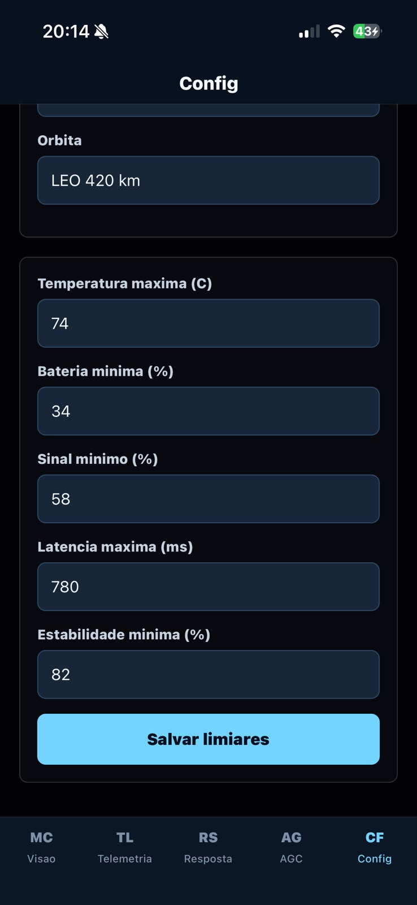
Persistencia dos limiares de temperatura, bateria, sinal, latencia e estabilidade usando AsyncStorage.

### AGC - Diferencial
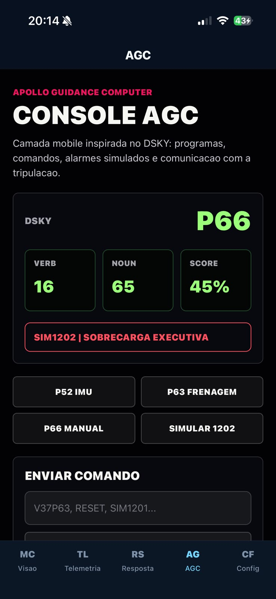
Console inspirado no Apollo Guidance Computer com programas, registradores, comandos e alarme simulado.

### Comunicacao com Tripulacao - Diferencial
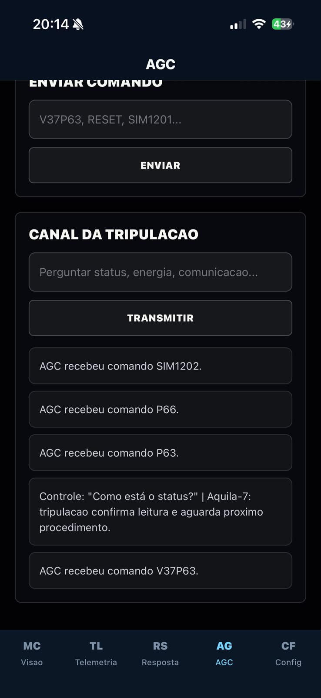
Canal simulado para interacao com a tripulacao da missao Aquila-7.

## Funcionalidades

- [x] Navegacao com Expo Router usando abas
- [x] Minimo de 3 dashboards com dados simulados distintos
- [x] Dashboard de sensores com temperatura e radiacao
- [x] Dashboard de energia com bateria e entrada solar
- [x] Dashboard de comunicacao com sinal e latencia
- [x] Context API implementada e consumida em multiplas telas
- [x] useReducer para estado global da missao
- [x] useState e useEffect em formularios, simulacao e persistencia
- [x] AsyncStorage para salvar configuracoes e limiares
- [x] Formulario funcional com validacao e feedback visual
- [x] Sistema de alertas automaticos por limiar critico
- [x] Simulador de incidentes de comunicacao, energia, temperatura e deriva orbital
- [x] Interface dark, responsiva e tematica espacial
- [x] TypeScript
- [x] Console AGC como diferencial visual e funcional

## Tecnologias

- React Native + Expo SDK 54
- Expo Router
- TypeScript
- Context API
- AsyncStorage
- React Native Reanimated
- React Native Screens
- React Native Safe Area Context

## Como Executar

### Pre-requisitos

- Node.js instalado
- Expo Go compativel com SDK 54
- iPhone ou Android conectado na mesma rede do computador

### Instalacao

Clone o repositorio:

```bash
git clone https://github.com/camposdigo/GS-CPAD.git
```

Acesse a pasta do projeto:

```bash
cd GS-CPAD
```

Instale as dependencias:

```bash
npm install
```

Inicie o projeto:

```bash
npm run start:lan
```

Escaneie o QR Code com o Expo Go para rodar no dispositivo fisico.

## Repositorio GitHub

[https://github.com/camposdigo/GS-CPAD](https://github.com/camposdigo/GS-CPAD)

## Video de Demonstracao

[Clique aqui para assistir a demonstracao](https://drive.google.com/drive/folders/1eRT5o-ETq_zl_Ntn2t4ijoVrT7hRldGj)

## Licenca

Este projeto foi desenvolvido para fins academicos - FIAP 2026.
